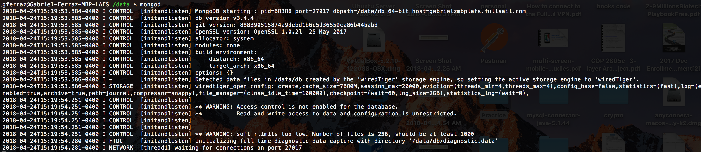
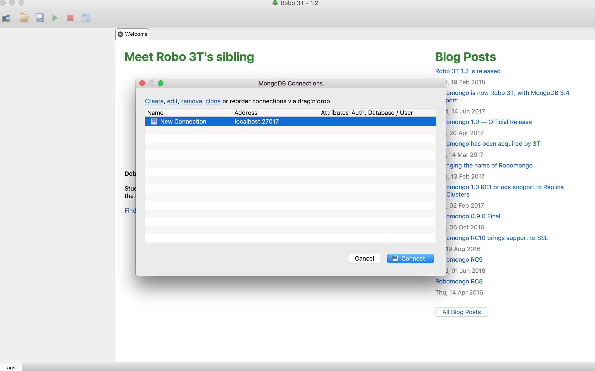
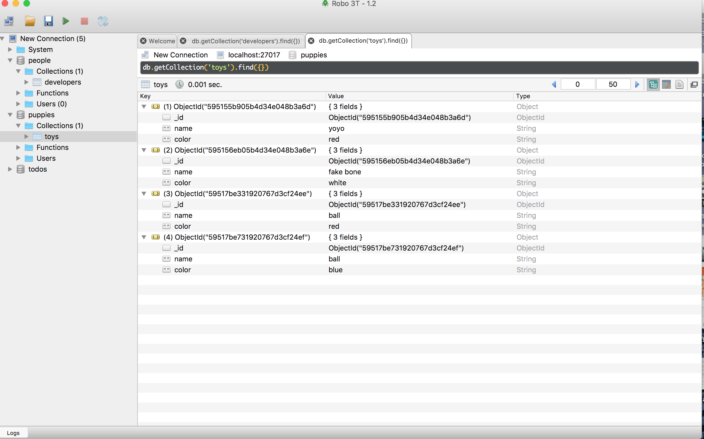
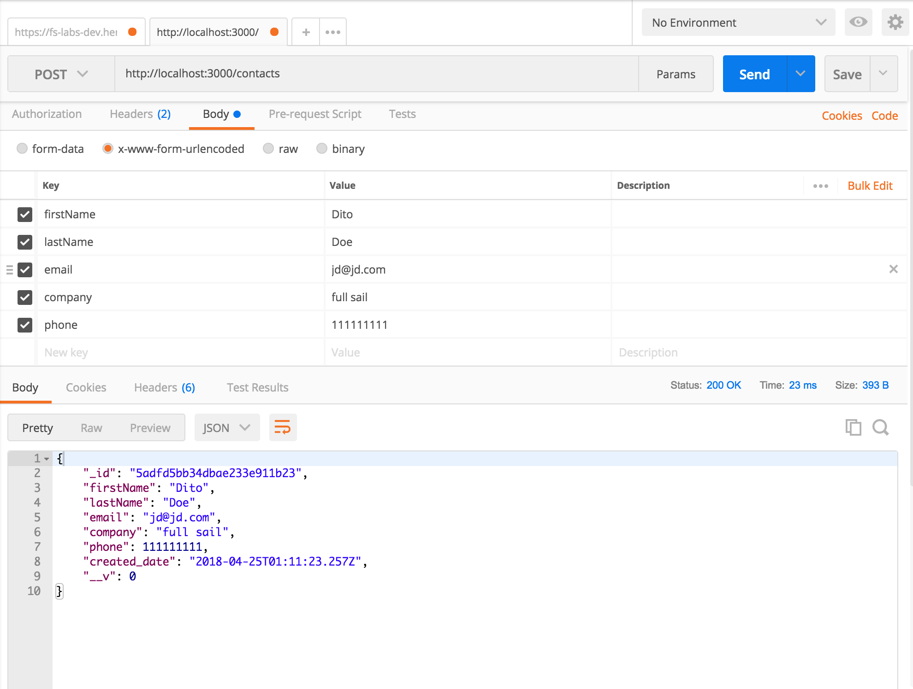
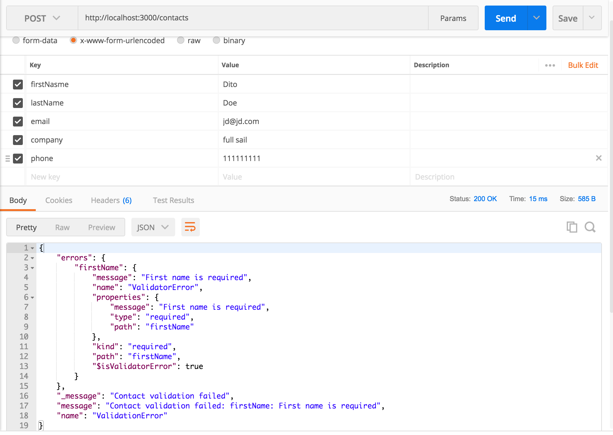
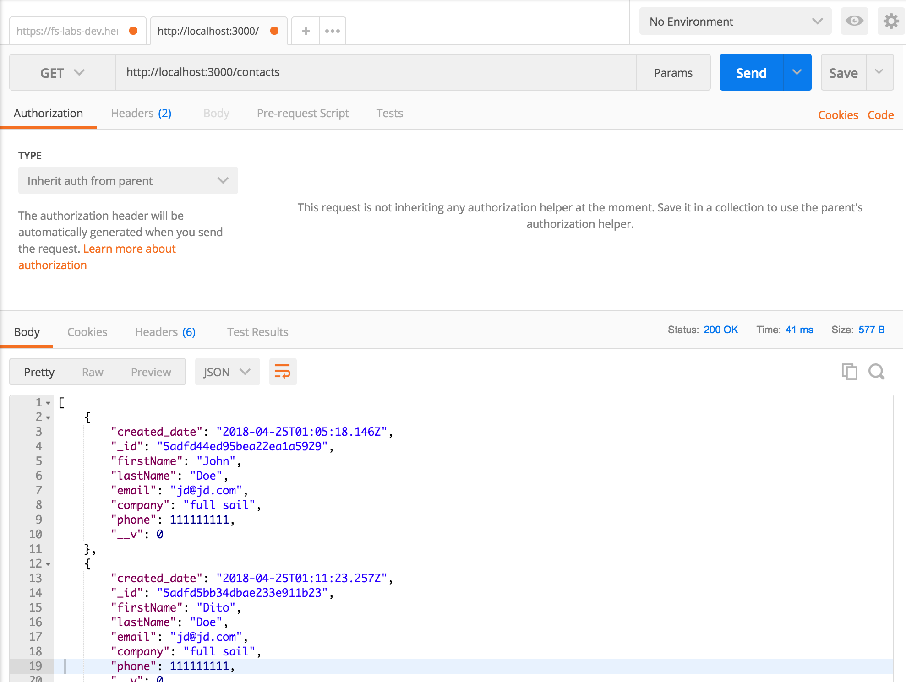
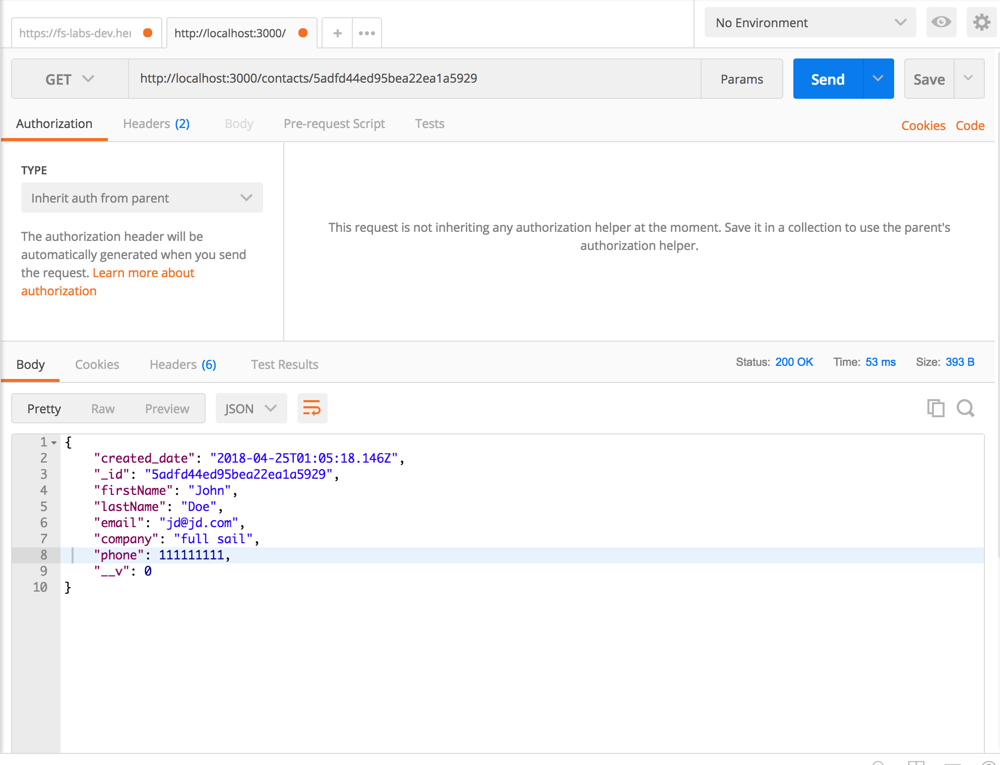

# node-express-mongdb-api

## Core software to start the api:

• Node and npm (nodemon is a nice to have)

• Express

• Mongo and mongoose

• babel-cli, babel-preset-env, babel-preset-stage-0

## Package.json script that starts the server

```javascript
"scripts": {
    "start": "nodemon ./index.js --exec babel-node -e js"
  }
```

This line translates as:

nodemon, start the index file and execute the babel-node binary file from the babel-cli package (check code in \node_modules\babel-cli\bin\babel-node.js)

babel-node, evaluate 'js' files (https://babeljs.io/docs/usage/cli/#babel-node)

Then we add the presets to a .babelrc file in the root of the project like so:

```javascript
{
  "presets": [
    "env",
    "stage-0"
  ]
}
```

## Server directory structure

### Option 1

/server

&nbsp;&nbsp;/controllers

&nbsp;&nbsp;/models

&nbsp;&nbsp;/routes

&nbsp;&nbsp;/middleware

### Option 2
/server

&nbsp;&nbsp;/api

&nbsp;&nbsp;&nbsp;&nbsp;/someTopic (i.e. users)

&nbsp;&nbsp;&nbsp;&nbsp;&nbsp;&nbsp;/someTopic.controller.js

&nbsp;&nbsp;&nbsp;&nbsp;&nbsp;&nbsp;/someTopic.model.js

&nbsp;&nbsp;&nbsp;&nbsp;&nbsp;&nbsp;/someTopic.route.js


&nbsp;&nbsp;&nbsp;&nbsp;/anotherTopic (i.e. catalogItems)

&nbsp;&nbsp;&nbsp;&nbsp;&nbsp;&nbsp;/anotherTopic.controller.js

&nbsp;&nbsp;&nbsp;&nbsp;&nbsp;&nbsp;/anotherTopic.model.js

&nbsp;&nbsp;&nbsp;&nbsp;&nbsp;&nbsp;/anotherTopic.route.js

&nbsp;&nbsp;&nbsp;&nbsp;/api.js
```javascript
//api.js
import express from 'express';
const router = express.Router();

// api router will mount other routers
// for all our resources
router.use('/someTopic', require('./someTopic/someTopic.route'));
router.use('/categories', require('./anotherTopic/anotherTopic.route'));

exports default router;
```

&nbsp;&nbsp;/models

&nbsp;&nbsp;/routes

&nbsp;&nbsp;/middleware


## Routes example

```javascript
// index.js

import express from 'express';
const app = express();
const router = express.Router();

import someRoute from './server/routes/someRoute';
app.use('/routePath', contactsRoutes(router));
```

```javascript
// someRoute.js

export default (router) => {
  // get and post use the same path
  router.route('/')
    .get((req, res) => res.send(`GET request on ${req.baseUrl}`))
    .post((req, res) => res.json(req.body))
    
  // put and delete use the same path
  router.route('/:id') 
    .put((req, res) => {
      // find the item by id in the DB, update it, and send it back
      // let item = find item and update
      res.json(item);
    })
    .delete((req, res) => {
      // find the item by id in the DB, delete it, and send it or a message back 
      // let item = find item
      // delete(item);
      res.json(item);
    });

  return router;
};
```


## Middleware example

```javascript
import express from 'express';
import morgan from 'morgan';

export default (app) => {
  app.use(morgan('dev'));
  app.use(express.urlencoded({ extended: true }));
  app.use(express.json());
};
```

## Mongodb 

[Installation and first steps](https://docs.mongodb.com/manual/tutorial/install-mongodb-on-os-x/)

In a mongodb database we have collections (e.g. users) that have documents (objects) that represent items in that collection

"Create the data directory.
Before you start MongoDB for the first time, create the directory to which the mongod process will write data. By default, the mongod process uses the /data/db directory. If you create a directory other than this one, you must specify that directory in the dbpath option when starting the mongod process later in this procedure.

The following example command creates the default /data/db directory:"

(You may need to use `sudo` to run the command below)

`mkdir -p /data/db` (-p, --parents: no error if existing, make parent directories as needed)

This is the directory where mongodb stores your data.

Make sure you have read and write permission on that directory otherwise the command below will not work. If you don't have permissions, set them using these commands:

`sudo chmod 0755 /data/db sudo chown $USER /data/db`

__run mongodb__

`mongod`


You should see something like this on your terminal:



Mongo listens for connections on port 27017.


## Mongoose

Mongoose allows us to set a schema for each collection and define what each key/value pair in the item (object) takes as a type

### Robomongo [https://robomongo.org/](https://robomongo.org/)

Robomongo is a GUI that allows us to interact with our mongdb database directly. 

After you start your mongodb (`mongod`) you can open the GUI and you should be able to see the dbs hosted on your system.

You should see this screen



You can see the databases you created and their content like so:





## Mongoose Schema (data model)
Mongoose is all about creating schemas for your databases. In mongoose, a schema is an object of objects. Each key in the inner object is the property to be saved to the DB. Inner objects have a mandatory "type" key, which specifies the property's data type.
[Check docs for a list of possible types as well as other key/pair values you can pass to your schema](http://mongoosejs.com/docs/schematypes.html)


e.g.

```javascript
// models/crmModel.js'

let ContactSchema = new Schema({
  firstName: {
    type: String,
    required: 'First name is required' // message returned if firstName is not sent
  },
  lastName: {
    type: String,
    required: 'Last name is required'
  },
  email: {
    type: String
  },
  company: {
    type: String
  },
  phone: {
    type: Number
  },
  created_date: {
    type: Date,
    default: Date.now 
  }
});

export default mongoose.model('Contact', ContactSchema);
```

## Mongoose controllers
Controllers controll the flow of data on your server. With mongoose, controllers are normally going to save data passed from the client to the api, throw errors if data is not valid, and call the next middleware so the server continues its flow to the end.

[For list of middleware and db methods, check "Schemas" in the documentation](http://mongoosejs.com/docs/)

e.g. 


```javascript
// models/crmController.js'

import Contact from '../models/crmModel.js';

// adds contact
const addContact = (req, res, next) => {
  let newContact = new Contact(req.body);  
  newContact.save((err, contact) => {
    if (err) {
      return next(new Error(`${err.name}: ${err._message}`)); // triggers the error middleware
    }
    
    res.json(contact);
  });
};

// gets all contacts
const getContacts = (req, res) => {
  Contact.find({}, (err, contact) => {
    if (err) {
      res.send(err);
    }

    res.json(contact);
  });
};

// gets contact by id 
const getContact = (req, res) => {
  Contact.findById(req.params.id, (err, contact) => {
    if (err) {
      res.send(err);
    }

    res.json(contact);
  });
};

// update contact
const updateContact = (req, res) => {
  Contact.findOneAndUpdate({_id: req.params.id}, req.body, { new: true }, (err, contact) => {
    if (err) {
      res.send(err);
    }

    res.json(contact);
  });
};

// delete contact
const deleteContact = (req, res) => {
  Contact.remove({_id: req.params.id}, (err, contact) => {
    if (err) {
      res.send(err);
    }

    res.json({ message: 'User successfully deleted.' });
  });
};
```

## Controllers + routes integration

Once you created your controllers, just pass them into the routes that match the action you want to perform (GET, POST, PUT, DELETE, etc):

```javascript
// routes/contactsRoutes.js
import { 
  addContact, 
  getContacts, 
  getContact,
  updateContact,
  deleteContact
} from '../controllers/crmController'

export default (router) => {
  router.route('/')
    .get(getContacts)  
    .post(addContact) 
  router.route('/:id') 
    .get(getContact) 
    .put(updateContact)
    .delete(deleteContact)

  return router;
};
```


## Test with Postman

For post requests use x-www-form-urlencoded:

__Success:__ -- object sent back from mongodb





__Fail:__ (key "firstName" misspelled) -- error generated by mongodb




__Get contacts__




__Get contact by ID__




